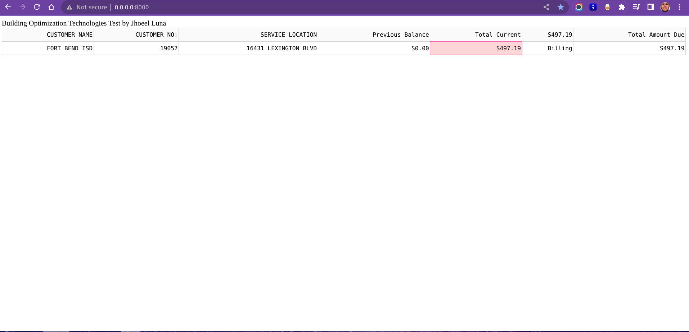

# Building Optimization Technologies Test
> Invoice Parsing and Detection to Dash by Jhoeel Luna
> https://www.linkedin.com/in/lunajhoeel/

This is a full containerized app that uses EasyOCR to detect and parse six parts of the image of an invoice. Then, it shows the results in a Dash app as a table. Since the data input is only one image, the table will only have one row.

## Requirements
For this project, you will need to install Docker Engine, Docker Desktop and WSL2 (for Windows users). Docker is needed for full machine learning projects as is stated in this blog link https://aws.amazon.com/blogs/opensource/why-use-docker-containers-for-machine-learning-development/.

## Installation
First, make sure you have Docker installed in your machine and you are running the Docker Engine and Docker Desktop.
Second, make sure you are inside the project folder.
Third, build the image with the command "Build the Docker Image" below in the terminal. This will take some minutes to download the dependencies. So it will depend on Internet speed too.
Fourth, run the container with the command "Run the Docker Container" below in the terminal. This too will take some minutes (the first time) because it will download the EasyOCR recognition model.
After some minutes of running the container, the Dash app will be shown in the browser at 'http://0.0.0.0:8000/' or 'http://localhost:8000' like this:

# Build the Docker image
docker build \
-t detect_invoice_image \
-f Dockerfile .

# Run the Docker Container
docker run \
--rm \
--name detect_invoice_container \
-p 8000:8000 \
detect_invoice_image

## Deletion
There is no need to stop the docker container as it is set to be stopped after the app is stopped. 
These commands below remove the Docker image and free up disk space. Careful, it will remove all images.

# Remove the Docker image
docker rmi \
detect_invoice_image

# Free up disk space
docker system prune \
--force